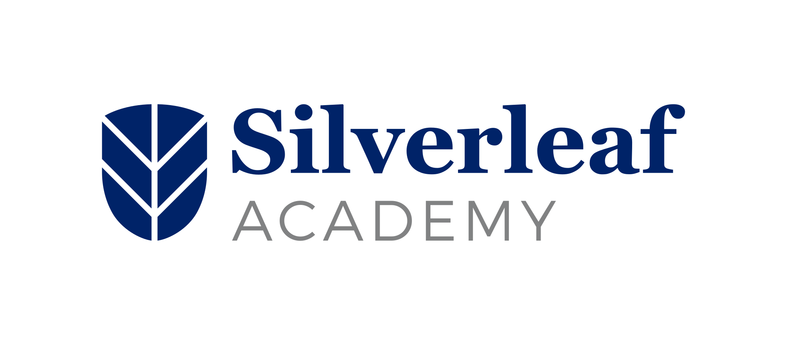

<p align="center">
  
</p>

<h1 align="center">SLA Onboarding Hub</h1>

<p align="center">
  Staff onboarding platform for <strong>Silverleaf Academy</strong> — bilingual journeys, view-only documents, progress tracking, and HR oversight.
</p>

<p align="center">
  <a href="https://github.com/kitili/SLA-Onboarding-hub"></a>
  <a href="https://github.com/kitili/SLA-Onboarding-hub"></a>
  <a href="https://github.com/kitili/SLA-Onboarding-hub"></a>
  
</p>

<p align="center">
  <a href="#quick-start">Quick start</a> ·
  <a href="#authentication">Authentication</a> ·
  <a href="#deploy-to-vercel">Deploy</a> ·
  <a href="#documentation">Documentation</a>
</p>

---

## What it does

- **Member journey** — sequential onboarding sections; staff read documents, mark items done, and pass a checkpoint quiz per section before the next section unlocks.
- **Admin CMS** — HR admins view completion dashboards and manage onboarding content from `/admin`.
- **Bilingual UI** — English (`en`) and Swahili (`sw`); locale prefix routes (`/en/…`, `/sw/…`).
- **Zero-setup local dev** — embedded [PGlite](https://electric-sql.com/docs/api/clients/pglite) when `DATABASE_URL` is unset.

## Tech stack

| Layer | Technology |
| --- | --- |
| Framework | Next.js 15 (App Router, TypeScript strict) |
| Database ORM | Drizzle ORM (PGlite locally, postgres-js on Vercel) |
| i18n | next-intl v4 — EN + SW |
| File storage | Local filesystem locally; Vercel Blob in production |
| Hosting | Vercel |

## Quick start

```bash
git clone https://github.com/kitili/SLA-Onboarding-hub.git
cd SLA-Onboarding-hub

npm install
npm run db:migrate   # embedded PGlite when DATABASE_URL is unset
npm run db:seed      # demo data (idempotent)
npm run dev          # http://localhost:3000
```

No environment variables are required for local development.

## Authentication

Only **`@silverleaf.co.tz`** work emails can sign in or register (`ALLOWED_EMAIL_DOMAIN`).

HR emails listed in `HR_ADMIN_EMAILS` receive admin access. An `ADMIN_PIN` is required for admin elevation.

Auth is **pluggable** — swap providers via `AUTH_PROVIDER` and `src/lib/auth/providers/`. See [`docs/identity.md`](docs/identity.md).

## Deploy to Vercel

Full runbook: [`docs/deploy.md`](docs/deploy.md)

1. Link the repo to a Vercel project (`vercel link`).
2. Add **Vercel Postgres** — auto-injects `DATABASE_URL`.
3. Add **Vercel Blob** — auto-injects `BLOB_READ_WRITE_TOKEN`.
4. Set `HR_ADMIN_EMAILS`, `ADMIN_PIN`, and `ALLOWED_EMAIL_DOMAIN` in the Vercel dashboard.
5. Run migrations against production before first deploy:
   ```bash
   DATABASE_URL=<prod-url> npm run db:migrate
   DATABASE_URL=<prod-url> npm run db:seed
   ```
6. Push to `main` — Vercel deploys automatically.

## Useful commands

| Command | Description |
| --- | --- |
| `npm run dev` | Next.js dev server |
| `npm run build` | Production build |
| `npm run typecheck` | TypeScript strict check |
| `npm run lint` | ESLint |
| `npm run test` | Vitest unit tests |
| `npm run e2e` | Playwright end-to-end tests |
| `npm run db:migrate` | Apply pending migrations |
| `npm run db:seed` | Seed demo data |

## Documentation

| Doc | Contents |
| --- | --- |
| [`docs/environment.md`](docs/environment.md) | Environment variables |
| [`docs/data-layer.md`](docs/data-layer.md) | Drizzle, migrations, repositories |
| [`docs/identity.md`](docs/identity.md) | Auth providers |
| [`docs/i18n.md`](docs/i18n.md) | Locales and messages |
| [`docs/materials.md`](docs/materials.md) | File storage adapters |
| [`docs/deploy.md`](docs/deploy.md) | Vercel go-live runbook |
| [CONTRIBUTING.md](./CONTRIBUTING.md) | Contribution guidelines |
| [SECURITY.md](./SECURITY.md) | Security policy |

## Legacy stack

The original React + Vite + Express app is preserved under `legacy/` for reference.

## License

Proprietary — internal use by **Silverleaf Academy** only. See [LICENSE](./LICENSE).

<p align="center">
  <sub>Silverleaf Academy · The Future Starts Here</sub>
</p>
