# Silverleaf Uniform Tracker

## Planning & Design Report

| | |
|---|---|
| **Product** | Silverleaf Uniform Tracker (`silverleaf-uniforms`) |
| **Document type** | Planning-week report — requirements understood, architecture and ERD agreed, diagrams included |
| **Period** | Week of 26 August 2026 (process meeting through design close) |
| **Prepared by** | Construction team — Mourine (platform), Geoffrey (desks), Irene (money) |
| **Reviewed with** | Nelly (parent / FIFO rules); operators Imani (store) and Loveness (tailoring) named on the map |
| **Status** | Design complete. Ready to enter **Phase 1 — Foundation, Sprint 1 (Platform & map)** |
| **Decision recorded** | Build the **complete** operations system (not a thin inventory-only slice) |
| **Version** | 1.0 — 31 August 2026 |

This is the submit-ready report. All diagrams are in this file. Preview or print from GitHub, Cursor, or any mermaid-capable markdown viewer so the figures render.

---

### Executive summary

Last week the team moved into the **initial planning and design** of a new school uniform management system. The work was to understand requirements, business rules, data structure, relationships between users and components, and how the system would operate — before writing product features.

We agreed:

1. **Who** — eight desks (Imani store, Loveness tailor, finance, CEO, campus admin, head teacher, principal, parent) and the role walls between them.
2. **Where** — five campuses (Usa River, Arusha Town / AM, Kijenge, Ilboru, Boma) and two warehouses (MAIN, Usa River shop). Kilizona is not in v1.
3. **What flows** — city buy and sewing into MAIN; Imani distributes; parents **order then pay** (FIFO by order date); campus staff issue paid kits; finance sees cost, sales, and a next-year size plan.
4. **Data** — one ERD covering parents, campuses, uniform requests, catalogue items (including tracksuits), inventory, materials (vitambaa / jora), student sizes, and system administration.
5. **Stack** — Next.js, Prisma, SQLite for build/demo, integer TZS, cookie sessions. Excel stays fallback until a campus is trained.

The rest of this report is that design, with diagrams. **Next steps and blockers at the end are Sprint 1 only** (Phase 1 Foundation — Platform & map). Later sprints are out of scope for this close-out.

---

### Contents

1. What this week settled  
2. Context — people and places  
3. Roles picture  
4. Software architecture  
5. Network / physical architecture  
6. Data architecture (ERD)  
7. Workflows (orders, stock, distribution, pricing, sizes, reporting)  
8. System administration and configuration  
9. How the zones connect  
10. SRS modules → tables → routes  
11. Constraints locked this week  
12. Next steps and blockers — **Sprint 1 only**

---

## 1. What this week settled

**Decision:** build the **complete** operations system (production, inventory, parent FIFO, distribution, money, year-end plan) — not a thin inventory slice.

**Replacing:** Google Sheets / Excel (Master sheet + 2026 Uniform Analysis). Excel stays fallback until a campus is trained; the app is then the record.

**Spine of the process** (from the meeting + system map):

```
Stock in → parents order online → campuses receive → finance plans next year
```

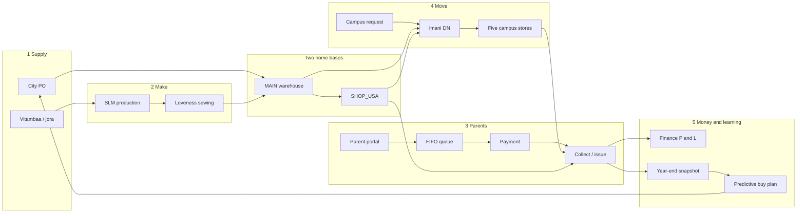

**People named on the map:** Imani (store & distribution), Loveness (tailoring + Usa River shop), Nelly (parent FIFO rules), campus admins & head teachers, finance.

**Campuses (five):** Usa River, Arusha Town (AM), Kijenge, Ilboru, Boma. Kilizona is on an older sheet only — **not** in v1.

---

## 2. Context — the system among people and places

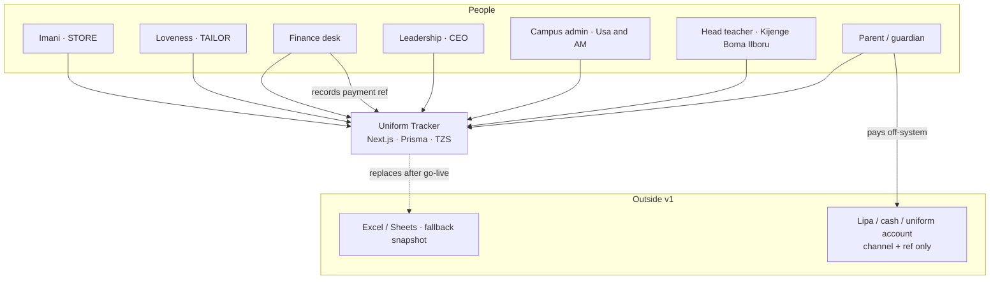

---

## 3. Roles picture

This is the roles picture from the system map, mapped onto the eight `User.role` values in the schema.

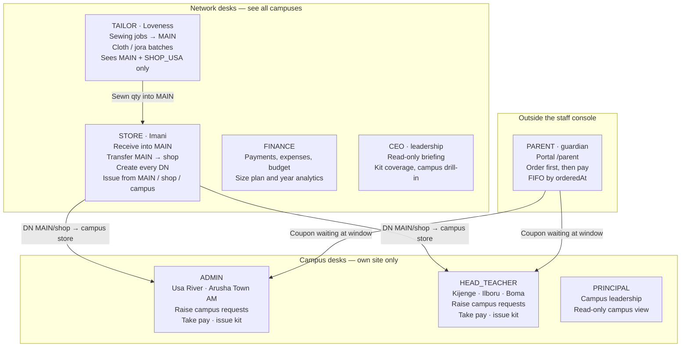

### 3.1 Who sits where

| Role | Named / pattern | Bound to campus? | What they see |
|------|-----------------|------------------|---------------|
| **STORE** | Imani | No | Whole network stock; every request; every DN |
| **TAILOR** | Loveness | Usa River | MAIN + SHOP_USA; sewing + cloth |
| **FINANCE** | Finance desk | No | Money, plan, year, payments |
| **CEO** | Leadership | No | Briefing / reports (read-only) |
| **ADMIN** | Usa River, AM administrators | Yes — that campus | Own campus stock, orders, requests, DNs in |
| **HEAD_TEACHER** | Kijenge, Boma, Ilboru | Yes — that campus | Same as ADMIN, for Mbegu campuses |
| **PRINCIPAL** | Campus / school leadership | Yes — that campus | Read-only campus view |
| **PARENT** | Guardian | Via family ↔ students | Own children’s orders only |

Campus request rights are **not** “any staff at any site”:

- `ADMIN` may request only for **USA** and **AM**
- `HEAD_TEACHER` may request only for **KIJENGE**, **ILBORU**, **BOMA**

That is `Campus.requestBy` plus `canRequestForCampus` in code.

### 3.2 Role × screen (staff console)

Matches `src/lib/roles.ts`. Parents never enter `/(app)`.

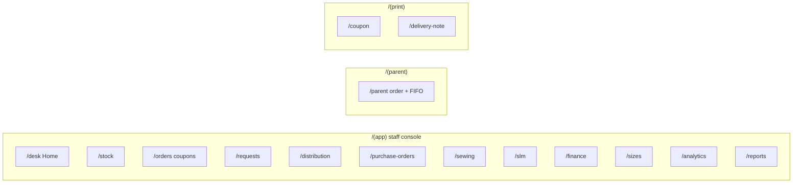

| Route | STORE | TAILOR | FINANCE | CEO | ADMIN | HT | PRINCIPAL | PARENT |
|-------|:-----:|:------:|:-------:|:---:|:-----:|:--:|:---------:|:------:|
| `/desk` | ● | ● | ● | ● | ● | ● | ● | |
| `/stock` | ● | ● | | | ● | ● | ● | |
| `/orders` | ● | | ● | ● | ● | ● | ● | |
| `/requests` | ● | | | | ● | ● | | |
| `/distribution` | ● | | | | ● | ● | ● | |
| `/purchase-orders` | ● | | ● | | | | | |
| `/sewing` `/slm` | ● | ● | | | | | | |
| `/finance` | ● | | ● | ● | | | | |
| `/sizes` `/analytics` | ● | | ● | ● | | | | |
| `/reports` | ● | | ● | **home** | ● | ● | ● | |
| `/parent` | | | | | | | | **home** |
| `/coupon` print | ● | | | | ● | ● | | |
| `/delivery-note` print | ● | | | | ● | ● | ● | |

CEO home is `/reports`. Everyone else on staff lands on `/desk` (Imani’s desk includes finance KPIs and links).

### 3.3 Visibility walls (server-side)

Role walls are not only nav pills — queries are scoped in `src/lib/visibility.ts`.

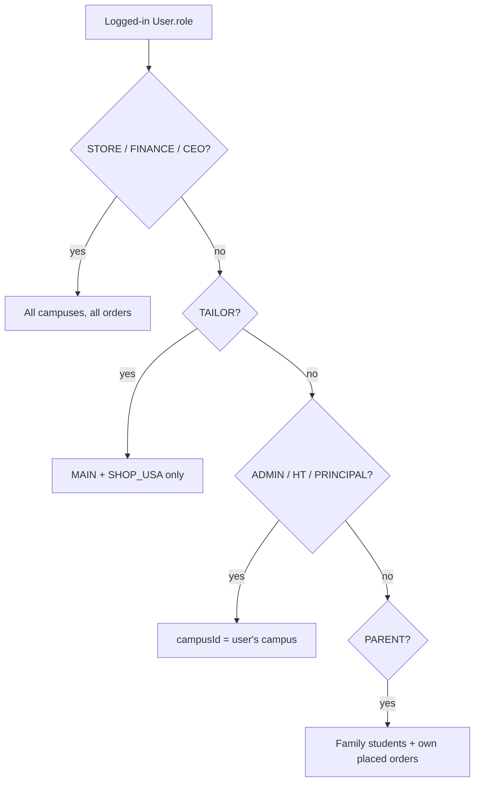

---

## 4. Software architecture

### 4.1 Containers

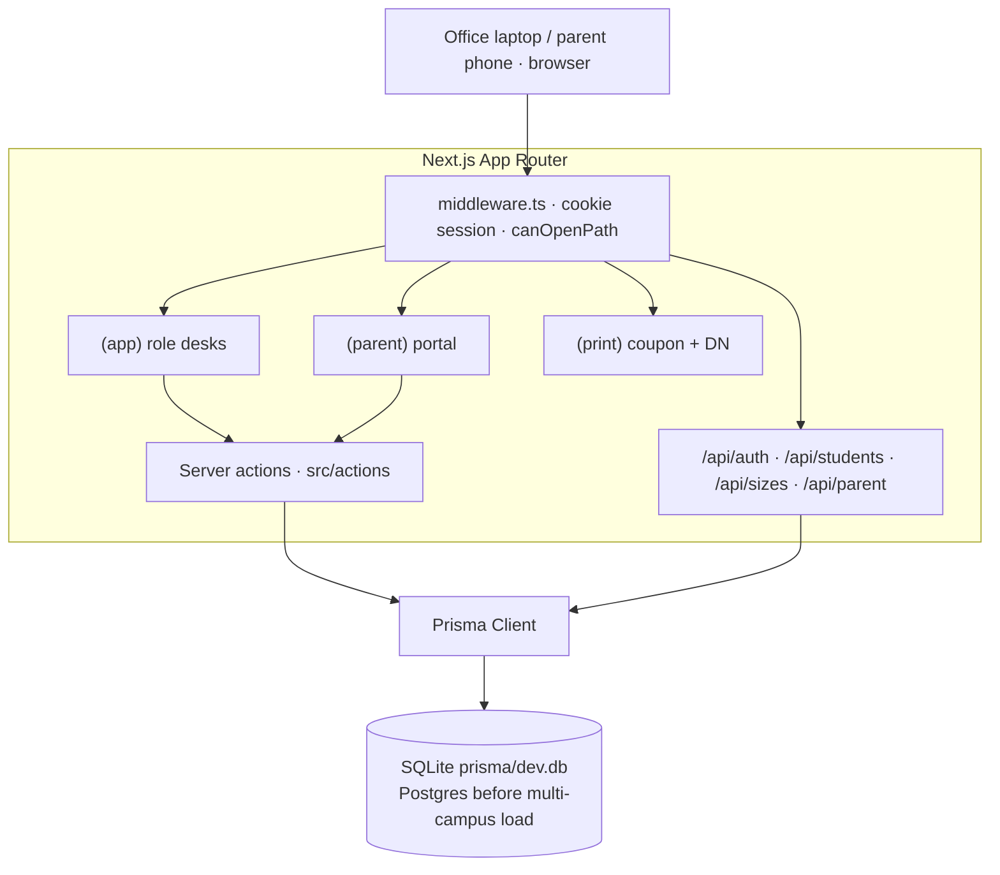

| Layer | Choice | Why |
|-------|--------|-----|
| App | Next.js App Router + TypeScript | Same family as Shule One; staff desks + parent portal |
| UI | React + Tailwind | Fast tables; no extra design system |
| Data | Prisma + SQLite in demo | `db:setup` reseeds; swap URL to PostgreSQL for production |
| Auth | Cookie `slu_session`, 7 days | Role on the token; walls in middleware + `requireUser` |
| Money | Integer **TZS** | Matches the sheets; no floats |
| Print | Dedicated print routes | Coupon + delivery note |

Not in v1: live Lipa API, barcodes, merge into Shule One.

### 4.2 Folder map (what talks to what)

```
src/app/
  login/                 public
  (app)/                 staff — role-scoped
    desk/ stock/ orders/ requests/ distribution/
    purchase-orders/ sewing/ slm/ finance/
    sizes/ analytics/ reports/ alerts/ audit/ train/
  (parent)/parent/       guardian — online order + FIFO
  (print)/coupon/        printable coupon
  (print)/delivery-note/ printable DN
src/actions/             mutations (orders, stock, DNs, POs, sewing, plan)
src/lib/                 roles, visibility, stock ledger, sheet-math, money
prisma/schema.prisma     ERD
```

### 4.3 Write path (every stock-changing action)

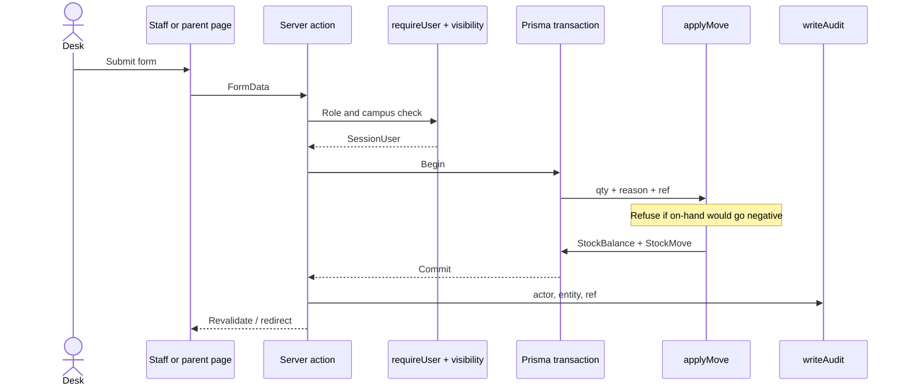

Stock is never updated by overwriting a cell. Every receive, sew-in, transfer, DN, parent issue, and adjust goes through `applyMove` (`src/lib/stock.ts`).

---

## 5. Network / physical architecture

Five campuses, **two warehouses**, plus **one store per campus**. City goods and sewn goods land in MAIN first.

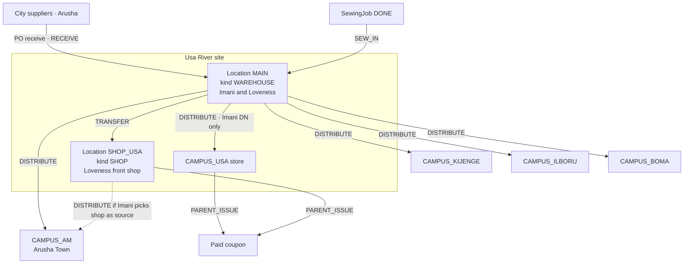

| Location code | Kind | Campus | Who operates it |
|---------------|------|--------|-----------------|
| `MAIN` | WAREHOUSE | — | Imani (receive, DN); Loveness (sew-in) |
| `SHOP_USA` | SHOP | Usa River | Loveness; Imani may transfer in and DN from here |
| `CAMPUS_USA` | CAMPUS | Usa River | Usa admin issues to parents |
| `CAMPUS_AM` | CAMPUS | Arusha Town | AM admin |
| `CAMPUS_KIJENGE` | CAMPUS | Kijenge | Head teacher |
| `CAMPUS_ILBORU` | CAMPUS | Ilboru | Head teacher |
| `CAMPUS_BOMA` | CAMPUS | Boma | Head teacher |

**Hard rules**

1. Purchase-order goods receipt is **into MAIN only**, then optional transfer to the shop.
2. A DN may leave **MAIN or SHOP** — never a campus store (`distribution.ts`).
3. Only **STORE** creates distributions.
4. Parent issue decrements the location that actually hands over the kit (campus store, shop, or MAIN).

---

## 6. Data architecture

Source of truth: [`prisma/schema.prisma`](../prisma/schema.prisma). The compact ERD in GOING-FORWARD is the same model; the diagrams below split it so each subject area is readable, then show the full relationship set.

**Grain reminder:** one catalogue row is a **SKU** (e.g. polo `PT1`). Stock is **SKU + size + location**, not one SKU per physical shirt.

### 6.1 Physical flow vs tables

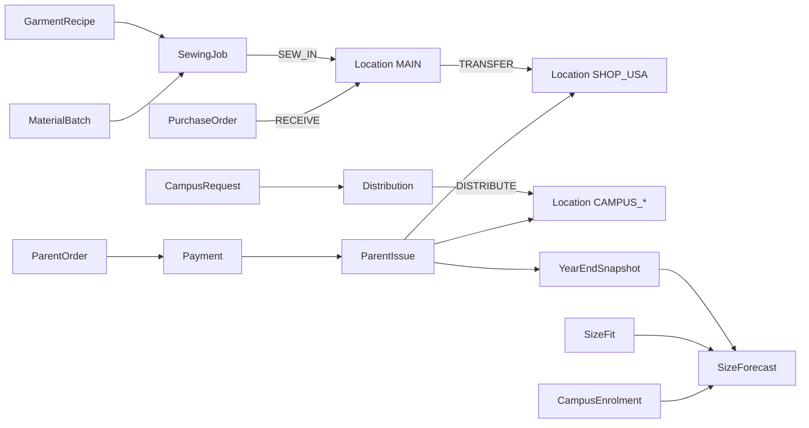

### 6.2 Organisation, people, students

Parents are not a special table — a `User` with `role = PARENT` belongs to a `Family`. Staff `User` rows optionally bind to one `Campus`.

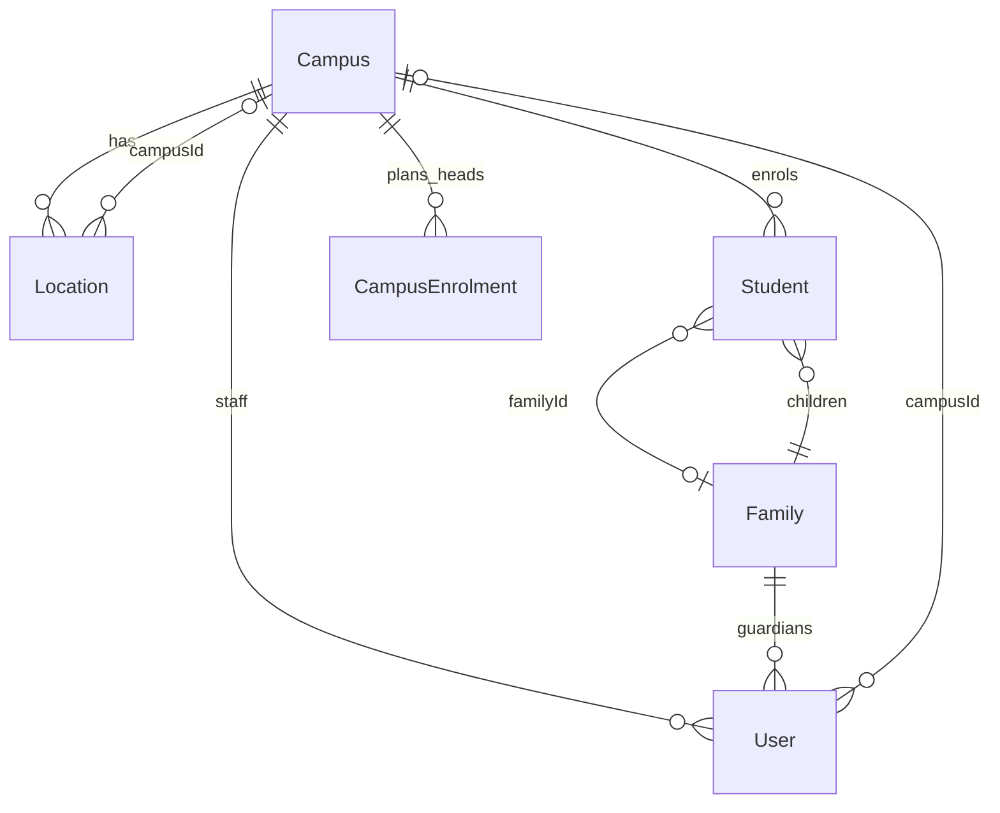

| Entity | Purpose |
|--------|---------|
| **Campus** | Five sites. `code` USA / AM / KIJENGE / ILBORU / BOMA. `requestBy` = ADMIN vs HEAD_TEACHER |
| **Location** | `MAIN`, `SHOP_USA`, or `CAMPUS_*`. `kind` WAREHOUSE / SHOP / CAMPUS |
| **User** | Desk login: `role`, optional `campusId`, optional `familyId`, `active` |
| **Family** | Groups parent users with students (siblings) |
| **Student** | Unique `regNo` (e.g. `SLA/UR/2023/312`) hydrates class, gender, campus |
| **CampusEnrolment** | Expected headcount by campus + year + class — input to the buy plan |

### 6.3 Catalogue, sizes, recipes

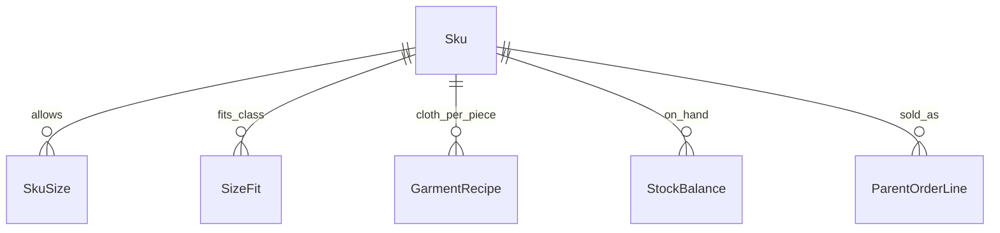

| Entity | Purpose |
|--------|---------|
| **Sku** | Catalogue item: code, name, colour, `kind` SCHOOL / BOARDING, gender, `buyTzs`, `sellTzs`, reorder point |
| **SkuSize** | Allowed sizes on that SKU (18–38; S/M plus numbers on tracksuits) |
| **SizeFit** | Which size fits which **class + gender** for a garment — drives required qty onto real sizes |
| **GarmentRecipe** | Metres/cm of jora or fabric each SKU+size needs |

**Day vs boarding colourways (seed / parent form)**

| Code | Name | Kind | Sell TZS | Buy TZS |
|------|------|------|----------|---------|
| SS1 | Navy sweater | SCHOOL | 25,000 | 18,000 |
| PT1 | Light-blue polo | SCHOOL | 15,000 | 11,000 |
| RT2 | Yellow round-neck | SCHOOL | 10,000 | 6,000 |
| TS1 | Light-blue tracksuit | SCHOOL | 30,000 | 22,000 |
| GS1 | Grey skirt / trouser (girl) | SCHOOL | 30,000 | 20,000 |
| BT1 | Grey trousers (boy) | SCHOOL | 30,000 | 20,000 |
| BSS1 / BPT1 / BRT2 / BTS1 | Boarding grey / red / black | BOARDING | same sell | same buy |

Pack per child (sheet math): day = PT1×2, SS1×1, RT2×1, TS1×1, GS1×1 (girl) or BT1×1 (boy). Boarding = BPT1×2, BSS1 / BRT2 / BTS1 ×1.

### 6.4 Inventory ledger

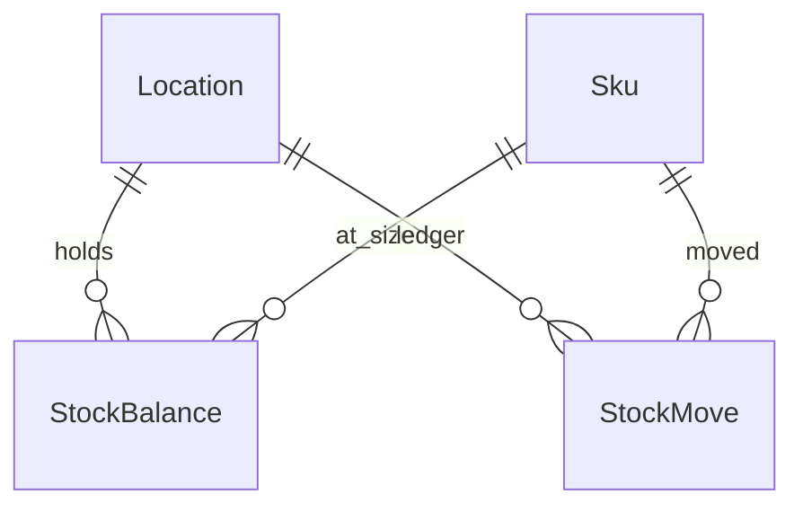

| Entity | Purpose |
|--------|---------|
| **StockBalance** | Qty on hand. Unique `(locationId, skuId, size)` |
| **StockMove** | Immutable ledger line: signed `qty`, `reason`, `ref`, `note`, `createdAt` |

**Move reasons** (`MOVE_REASONS`)

| Reason | Sign at location | When |
|--------|------------------|------|
| `RECEIVE` | + MAIN | PO goods in |
| `SEW_IN` | + MAIN (or job location) | Sewing job completed |
| `TRANSFER_OUT` / `TRANSFER_IN` | − source / + dest | MAIN → SHOP_USA |
| `DISTRIBUTE` | − MAIN or shop / + campus store | Imani DN |
| `PARENT_ISSUE` | − issuing location | Kit handed over |
| `ADJUST` | ± | Correction; still cannot go below zero |

`applyMove` refuses any post that would make on-hand negative.

### 6.5 Parent demand — order, pay, issue

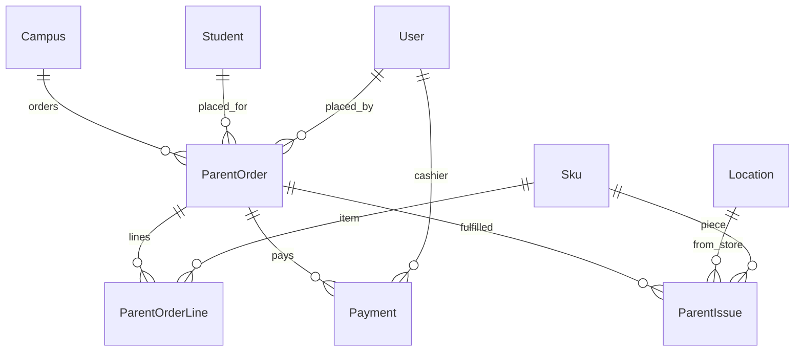

| Entity | Purpose |
|--------|---------|
| **ParentOrder** | Coupon. `orderedAt` is the **FIFO key**. Status ORDERED → PAID → PARTIAL / FULFILLED |
| **ParentOrderLine** | SKU, size, qty, `unitTzs` (sell price snapshot), `issued` so far |
| **Payment** | Second step. Channel CASH / LIPA / UNIFORM_ACCOUNT. Partial amounts allowed; kit issue waits until **paid in full** |
| **ParentIssue** | Hand-over event. Supports Received all / Received few |

**FIFO:** queue position is earlier unpaid-or-unfulfilled orders by `orderedAt` ascending. Payment date does **not** jump the line. Nelly’s rule: **order first, then pay**.

`PARTIAL` on the order means **some pieces issued**, not a part-payment.

### 6.6 Campus request and distribution

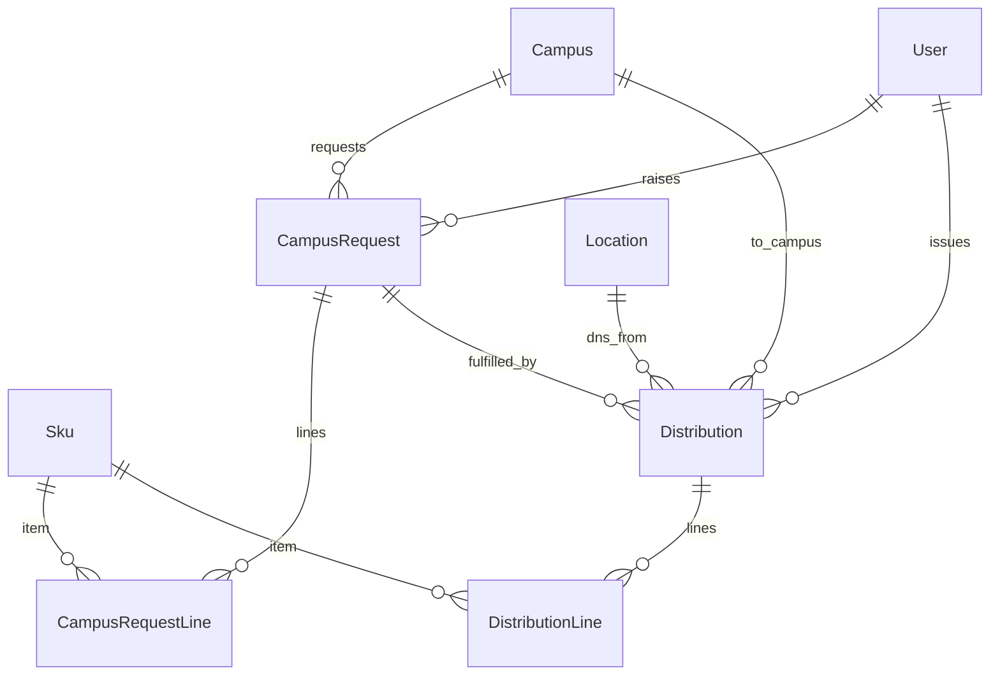

| Entity | Purpose |
|--------|---------|
| **CampusRequest** | Admin/HT ask. Status OPEN / FULFILLED / CANCELLED. Lines: SKU, size, qty, `neededBy` |
| **Distribution** | Delivery note. STORE only. Optional link to a request. `receiver` name on the DN |
| **DistributionLine** | What moved |

Posting a DN writes two `StockMove` rows (out of source, into campus store) and marks the request FULFILLED when linked.

### 6.7 Buying, SLM, money, year plan

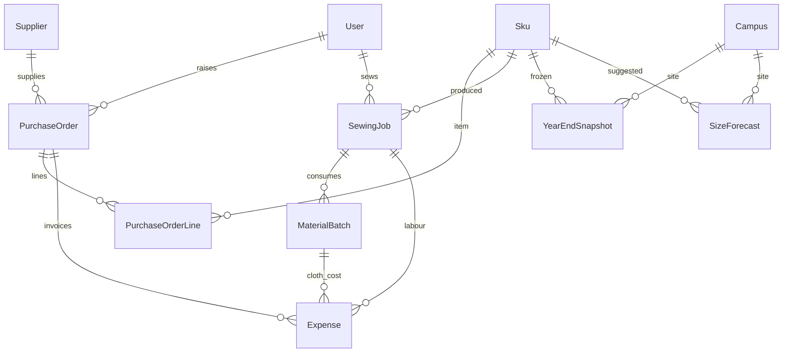

| Entity | Purpose |
|--------|---------|
| **Supplier** | City vendors (from master pricing sheet) |
| **PurchaseOrder** | DRAFT → SENT → PARTIAL → CLOSED. Receive into MAIN |
| **PurchaseOrderLine** | SKU, size, qty, `unitTzs` (buy), `received` |
| **MaterialBatch** | Cloth/jora bought: `qty`, `remaining`, unit, `unitCostTzs` |
| **SewingJob** | Loveness daily: expected vs actual, QUEUED → IN_PROGRESS → DONE |
| **Expense** | Supplier invoices, tailor labour, materials |
| **Budget** | Year allocation vs committed POs vs actual receive |
| **YearEndSnapshot** | Frozen issued / stock left / revenue / cost by year + campus + SKU + size |
| **SizeForecast** | Next-year suggested buy (`method` from OVERALL sheet math, not a guess) |
| **AuditEvent** | Who touched stock, pay, distribute, PO receive |

`Budget` and `AuditEvent` are standalone (no FK to Campus / User). `Expense.campusId` is optional and not a Prisma relation.

### 6.8 Full relationship set (one diagram)

Same core as GOING-FORWARD §4, with Family and the money/plan tables the live schema actually has.

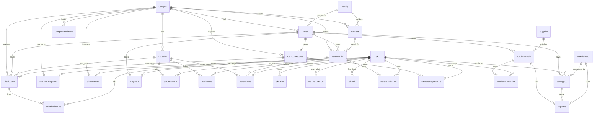

---

## 7. Workflows

### 7.1 Parent uniform request — order, FIFO, pay, collect

Nelly: **order precedes payment**. Fulfilment order is `orderedAt`, not who paid first and not who shouts first.

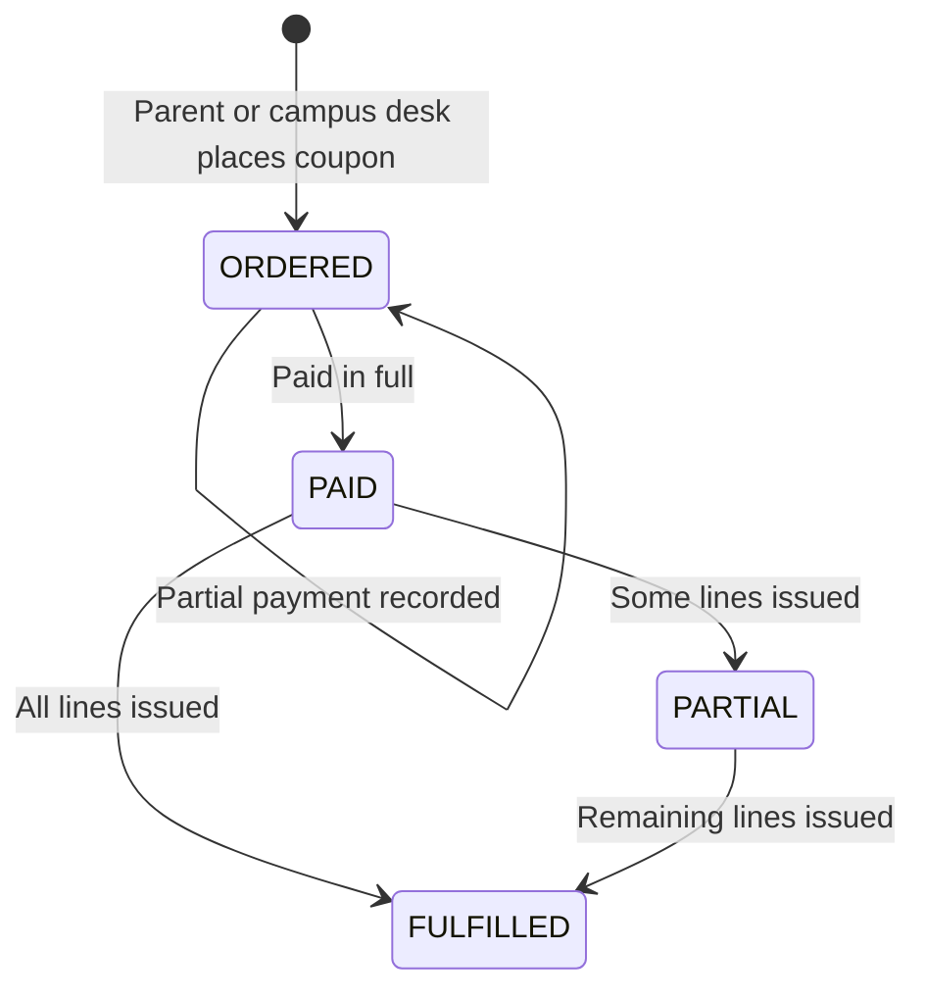

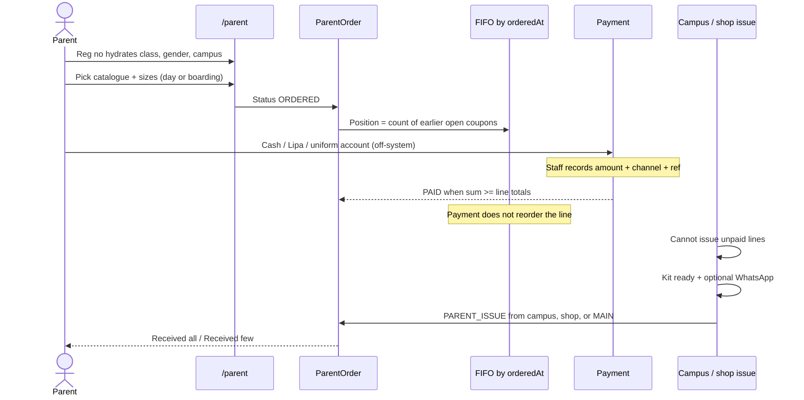

**Stock availability at issue:** `applyMove` with `PARENT_ISSUE` fails if that location+SKU+size would go negative. Partial issue is allowed (`issued` on the line vs `qty`).

Who may write orders / take pay / issue:

| Action | STORE | FINANCE | ADMIN / HT | PARENT |
|--------|:-----:|:-------:|:----------:|:------:|
| Place order | ● | | ● (own campus) | ● (linked child) |
| Record payment | ● | ● | ● | |
| Issue kit | ● | | ● (own campus store) | |

STORE may issue from MAIN, SHOP_USA, or the order’s campus store. Campus desks issue only from their own campus store.

### 7.2 Campus request → Imani assigns / distributes

Usa River and AM **admins** request; Kijenge, Boma, Ilboru **head teachers** request. Imani sees **one queue** of open requests and is the only person who creates a DN.

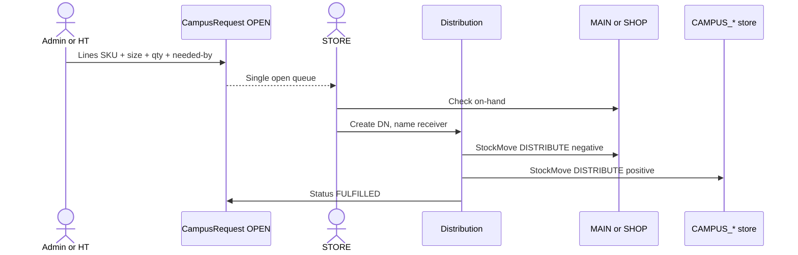

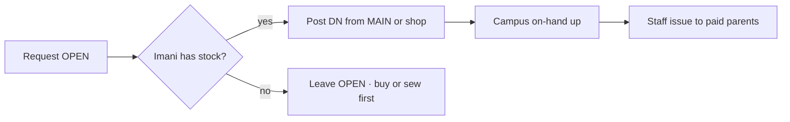

### 7.3 Inventory in — city buy and shop transfer

```mermaid
stateDiagram-v2
  [*] --> DRAFT: STORE or FINANCE raises PO
  DRAFT --> SENT: Sent to supplier
  SENT --> PARTIAL: Some lines received
  SENT --> CLOSED: All received
  PARTIAL --> CLOSED: Remainder received
  DRAFT --> DRAFT: Draft PO from /sizes plan overwrites PO-PLAN-year
```

```mermaid
flowchart LR
  Plan["/sizes OVERALL math"] --> DraftPO[PO-PLAN-2027 DRAFT]
  DraftPO --> Receive[Goods receipt]
  Receive -->|"RECEIVE +qty"| MAIN
  MAIN -->|"TRANSFER_OUT / IN"| Shop[SHOP_USA]
```

City purchases **must** receive into MAIN first. Transfer to the shop is a separate movement. Cost lives on `PurchaseOrderLine.unitTzs` and related `Expense` rows.

### 7.4 SLM — materials, sewing, ready-made

```mermaid
flowchart TB
  BuyCloth[Record MaterialBatch<br/>jora / fabric · qty remaining] --> Recipe[GarmentRecipe<br/>SKU + size → cm per piece]
  Recipe --> Job[SewingJob QUEUED]
  Job --> Run[IN_PROGRESS]
  Run --> Done[DONE · actual qty]
  Done --> Consume[Consume batches FIFO by createdAt]
  Done --> SewIn["SEW_IN onto MAIN"]
  Consume --> Expense[Expense · cloth + labour]
```

Student size collection (`SizeFit` + parent order sizes + optional sewing-tracker notes) feeds **what** Loveness should queue, and later the **buy plan** — not a separate inventory of children.

### 7.5 Pricing, sales, profit

```mermaid
flowchart LR
  SkuBuy[Sku.buyTzs default] --> POLine[PO line unitTzs actual]
  SkuSell[Sku.sellTzs] --> Coupon[ParentOrderLine unitTzs snapshot]
  Coupon --> Rev[Sum of issued × sell]
  POLine --> CostBuy[City buy cost]
  Expense --> CostSew[Jora + labour]
  Rev --> Profit[Profit = sell − buy − sewing]
  CostBuy --> Profit
  CostSew --> Profit
```

- Catalogue prices can be updated on the SKU; a coupon **keeps** the `unitTzs` from order time.
- Payment channels: cash, Lipa, uniform account (ref stored; no live API).
- Finance views: network and campus; budget vs committed POs vs actual receive.
- Sewing P&L (sheet): city-buy replacement − (jora + labour) = saved.

### 7.6 Size collection, availability, reporting, next-year buy

```mermaid
flowchart TB
  Collect[Sizes in: SizeFit + orders + issues] --> Snap[YearEndSnapshot]
  Enrol[CampusEnrolment heads] --> Overall[OVERALL sheet math]
  Snap --> Overall
  OnHand[MAIN + campus leftover] --> Overall
  Pack[SCHOOL_PACK / BOARDING_PACK] --> Overall
  Overall --> Need["required = enrolment × pack"]
  Need --> Gap["orderQty = max(0, required − leftover)"]
  Gap --> Alloc[Allocate MAIN leftover across campuses]
  Alloc --> Fc[SizeForecast suggestedBuy]
  Fc --> PlanPO[Draft PO from plan]
  Fc --> Report["/analytics /reports /sizes"]
```

Do **not** forecast with `issued × 1.1` or invented size shares. Refresh buy plan writes `SizeForecast` from `loadOverallPlan` only (`docs/source/EXCEL-IMPORT.md`).

**Reports the desks actually use**

| Surface | Audience | Content |
|---------|----------|---------|
| `/stock` | Imani, Loveness, campus | On-hand by location + SKU + size; low-stock vs reorder |
| `/orders` | Imani, finance, campus | Coupons, FIFO, paid vs waiting |
| `/alerts` | Store | Low sizes, cloth shortfall |
| `/finance` | Finance, STORE, CEO | Budget, spend, sales, profit |
| `/sizes` | Finance, STORE, CEO | Class fit, OVERALL buy plan, draft PO |
| `/analytics` | Finance, STORE, CEO | Year-end issued / leftover / margin |
| `/reports` | CEO + campus leadership | Kit coverage briefing (campus drill-in for admin/HT) |
| `/audit` | STORE, FINANCE, CEO | Who touched stock, pay, DN, PO receive |

---

## 8. System administration and configuration

The Excalidraw “system admin → configs” zone maps to data, not a separate product.

```mermaid
flowchart LR
  subgraph Config["Configuration data"]
    Campuses[5 Campus rows + requestBy]
    Locs[Locations MAIN / SHOP / CAMPUS_*]
    Users[User + role + campus + active]
    Catalogue[Sku + SkuSize + buy/sell]
    Fit[SizeFit class × gender]
    Recipe[GarmentRecipe]
    Suppliers[Supplier list]
    Budget[Budget year TZS]
    Enrol[CampusEnrolment]
  end
  subgraph Runtime["Runtime"]
    Auth[Cookie session 7 days]
    Nav[Role × route matrix]
    Audit[AuditEvent]
  end
  Config --> Runtime
```

| Admin concern (map) | Where it lives |
|---------------------|----------------|
| Pin campuses; admin vs HT | `Campus` + seed |
| Desk login; deactivate user | `User.active`; `M1-F01` |
| Update stock and prices | `Sku.sellTzs` / `buyTzs`; stock via ledger not a raw edit |
| Manage suppliers | `Supplier` |
| Staff notifications | Kit-ready / WhatsApp from the orders desk (v1: copy/link, not a gateway) |
| Purchases & sales log | `StockMove` + `Payment` + `/audit` |

---

## 9. End-to-end: how the zones connect

Same legend as the Excalidraw board: mint = supply, pink = sewing, blue = parents & campuses, yellow = money.

```mermaid
flowchart TB
  subgraph Supply["Supply"]
    RM[Ready-made PO]
    VT[Vitambaa batches]
  end
  subgraph Make["Make"]
    SEW[Sewing jobs]
  end
  subgraph Stock["Stock"]
    BAL[StockBalance per location+SKU+size]
  end
  subgraph Parents["Parents"]
    ORD[ParentOrder FIFO]
  end
  subgraph Dist["Distribution"]
    DN[Imani DN]
  end
  subgraph Money["Money"]
    PNL[Payments expenses profit]
    YR[Year snapshot + forecast]
  end

  RM --> BAL
  VT --> SEW
  SEW --> BAL
  ORD --> PNL
  BAL --> DN
  DN --> BAL
  ORD --> BAL
  BAL --> YR
  PNL --> YR
```

---

## 10. SRS modules → tables → routes

| SRS | Module | Core tables | Staff route |
|-----|--------|-------------|-------------|
| M1 | Platform & roles | User, AuditEvent | `/login`, `/audit`, `/train` |
| M2 | Campuses & warehouses | Campus, Location | `/desk` |
| M3 | Catalogue | Sku, SkuSize | `/stock`, `/parent` |
| M4 | Stock ledger | StockBalance, StockMove | `/stock`, `/alerts` |
| M5 | Parent portal & FIFO | ParentOrder, ParentOrderLine, Student, Family | `/parent`, `/orders` |
| M6 | Payments & profit | Payment, Expense, Budget | `/finance` |
| M7 | Campus requests | CampusRequest, CampusRequestLine | `/requests` |
| M8 | Distribution & DNs | Distribution, DistributionLine, ParentIssue | `/distribution`, `/delivery-note` |
| M9 | Purchase orders | Supplier, PurchaseOrder, PurchaseOrderLine | `/purchase-orders` |
| M10 | Demand & size analytics | SizeFit, YearEndSnapshot, SizeForecast, CampusEnrolment | `/sizes`, `/analytics` |
| M11 | Sewing / SLM | SewingJob, MaterialBatch, GarmentRecipe | `/sewing`, `/slm` |
| M12 | Printables | (views over Order / Distribution) | `/coupon`, `/delivery-note` |

---

## 11. Constraints the diagrams assume

These are the rules this week locked. Diagrams that contradict them are wrong.

1. **Five campuses only** — Usa River, AM, Kijenge, Ilboru, Boma.
2. **All city purchases land in MAIN first.**
3. **Only Imani (STORE) initiates campus distribution.**
4. **Parent order before payment.** FIFO is `orderedAt` ascending.
5. **Cannot fulfil unpaid lines.** Issue waits until paid in full; `PARTIAL` means partial kit, not partial pay.
6. **Cannot issue more than on-hand** at that location+SKU+size.
7. **Admins request for USA/AM; head teachers for Kijenge/Boma/Ilboru.**
8. **Campus desks see their campus only.** STORE / FINANCE / CEO see the network. TAILOR sees MAIN + shop.
9. **Amounts are integer TZS.**
10. **Role walls are enforced server-side** (middleware + `requireUser` + query `where`).
11. **Excel is the import snapshot**, not the live ledger after a campus is trained.
12. **No live Lipa API, no barcodes, no Shule One merge, no Kilizona** in this architecture.

---

## 12. Next steps and blockers — Sprint 1 only

This report closes **planning**. The phased plan is eight one-week sprints. **This close-out commits only to Sprint 1.** Sprint 2 (catalogue & stock) and later phases are not next steps here.

**Phase 1 — Foundation** has two sprints. We enter the first:

| | |
|---|---|
| **Phase** | 1 — Foundation |
| **Sprint** | **1 — Platform & map** |
| **Length** | One week · six day-sized tasks · two per person (A holds the schema extra) |
| **Goal** | Campuses, warehouses, roles, and a home desk that matches the system map — so every named operator can log in and see the right wall |
| **Not this sprint** | Catalogue SKUs, stock ledger UI, parent FIFO, DNs, POs, sewing, analytics |

```mermaid
flowchart LR
  Plan[This report · design agreed] --> S1[Sprint 1 · Platform and map]
  S1 --> Gate{Friday demo:<br/>five desks can log in?}
  Gate -->|yes| Hold[Hold for Sprint 2 — not in this report]
  Gate -->|no| Fix[Stay on Sprint 1 blockers below]
```

### 12.1 Sprint 1 next steps

Three streams. Mourine owns Prisma — Geoffrey and Irene consume it; no forked models.

```mermaid
gantt
  title Sprint 1 — Platform and map
  dateFormat  YYYY-MM-DD
  axisFormat  %a %d
  section A Platform · Mourine
  TASK-001 Prisma campuses warehouses users roles     :a1, 2026-08-31, 1d
  TASK-002 Session auth and role nav                  :a2, after a1, 1d
  TASK-003 Seed five campuses two warehouses desks    :a3, after a2, 1d
  section B Desks · Geoffrey
  TASK-004 Home desk Tailoring to Campuses map        :b1, 2026-09-01, 2d
  TASK-005 Finance and campus landings                :b2, after b1, 1d
  section C Money · Irene
  TASK-006 README and db setup smoke                  :c1, 2026-09-02, 2d
  section Gate
  Friday desk demo Imani Loveness finance admin HT    :milestone, m1, 2026-09-04, 0d
```

Dates on the chart assume Sprint 1 starts **Monday 31 August 2026** (report date). Shift them if the calendar slides; the **task order** does not change.

| ID | Owner | Next step | Done when |
|----|-------|-----------|-----------|
| **TASK-001** | A Mourine | Prisma schema: `Campus`, `Location`, `User` + roles | Five campus codes and MAIN + SHOP_USA are in the model; `prisma generate` succeeds |
| **TASK-002** | A Mourine | Session auth + role nav matching the roles picture (section 3) | Login sets httpOnly cookie; unknown role cannot open STORE routes; logout clears session; session lasts 7 days |
| **TASK-003** | A Mourine | Seed five campuses, two warehouses, named desks | Imani, Loveness, finance, two admins, three HTs, one parent; password `Silverleaf@2026`; `npm run db:setup` can re-run after reset |
| **TASK-004** | B Geoffrey | Home desk that mirrors **Tailoring → Inventory → Distribution → Campuses** | STORE and TAILOR see the four-stage map with counts or links; stages match the process map |
| **TASK-005** | B Geoffrey | Finance and campus views as separate landings | FINANCE lands on costs/budget summary; ADMIN/HT land on **their campus only**; PARENT does not see staff nav |
| **TASK-006** | C Irene | README + `npm run db:setup` smoke | README lists demo accounts; docs linked; db:setup documented; TZS helper in place for later money screens |

**Sprint 1 sequence (dependency, not preference)**

```mermaid
flowchart TB
  T001[TASK-001 Schema] --> T002[TASK-002 Auth and nav]
  T001 --> T003[TASK-003 Seed]
  T002 --> T004[TASK-004 Home map]
  T003 --> T004
  T002 --> T005[TASK-005 Landings]
  T003 --> T005
  T003 --> T006[TASK-006 README smoke]
  T004 --> Demo[Friday: log in as each desk]
  T005 --> Demo
  T006 --> Demo
```

**Sprint 1 definition of done**

1. Each of the six tasks meets the acceptance column above.
2. A person can log in as Imani, Loveness, finance, one Usa/AM admin, one Mbegu HT, and a parent — and each sees a different home.
3. Excel remains the live operations tool this week; the app is a **shell with real campuses and roles**, not stock movement yet.
4. Friday demo on those desks. No Sprint 2 work is pulled forward.

**Demo accounts (seed target for TASK-003)**

| Desk | Email | Role |
|------|-------|------|
| Imani (store & finance) | imani@silverleaf.ac.tz | STORE |
| Loveness | loveness@silverleaf.ac.tz | TAILOR |
| Usa River admin | usa.admin@silverleaf.ac.tz | ADMIN |
| Arusha Town admin | am.admin@silverleaf.ac.tz | ADMIN |
| Kijenge / Boma / Ilboru HT | kijenge.ht@ / boma.ht@ / ilboru.ht@silverleaf.ac.tz | HEAD_TEACHER |
| Parent | parent@silverleaf.ac.tz | PARENT |

Shared demo password: `Silverleaf@2026`.

### 12.2 Sprint 1 blockers (phased — what would stop this week)

These are the blockers we would have to clear **before or during Sprint 1**. They are not Sprint 2–8 issues.

| # | Blocker | Why it stops Sprint 1 | Who unblocks | If it stays blocked |
|---|---------|------------------------|--------------|---------------------|
| B1 | **Campus list not signed** (five vs Kilizona on an older sheet) | TASK-001/003 cannot freeze `Campus.code` or seed locations | Product / Paul | Do not seed a sixth campus. Default remains USA, AM, KIJENGE, ILBORU, BOMA |
| B2 | **Roles picture not signed** (section 3) | TASK-002 nav and TASK-005 landings will be ripped out | Team + Nelly on parent | Freeze the eight roles in this report; extra desks go to a later note, not Sprint 1 |
| B3 | **Who may request stock** (admin vs head teacher by campus) | Seed `User.campusId` and `Campus.requestBy` are wrong | Meeting rule already in SRS | ADMIN → Usa + AM only; HEAD_TEACHER → Kijenge, Ilboru, Boma |
| B4 | **Named operators missing emails** (Imani, Loveness, finance) | TASK-003 has nothing to seed | Ops | Use the `@silverleaf.ac.tz` accounts in the table above until HR confirms |
| B5 | **Prisma not owned by one person** | Geoffrey/Irene fork models; home desk binds to the wrong Campus | Mourine (stream A) | TASK-004/005 wait on TASK-001. No parallel schema |
| B6 | **TASK-001 late** | Auth, seed, and UI have no tables | Mourine | B and C idle on schema-dependent work; Irene can still draft README copy |
| B7 | **Node 20+ / `AUTH_SECRET` / SQLite path not on laptops** | `db:setup` and login fail; Friday demo dies | Irene + Mourine | Document in TASK-006 on day 1, not day 5 |
| B8 | **Home map disagrees with the process drawing** | TASK-004 acceptance is “matches the system map stages” | Geoffrey vs map in section 1 | Stages are Tailoring → Inventory → Distribution → Campuses. Do not invent a fifth stage |
| B9 | **Pressure to build stock or catalogue this week** | Sprint 1 scope explodes; roles/nav slip | Team lead | Catalogue is Sprint 2. This sprint is login, campuses, warehouses, map |
| B10 | **Parent seeing staff nav** | TASK-005 fails; role wall is the whole point of Sprint 1 | Geoffrey after TASK-002 | PARENT home is `/parent` only — even if that page is a stub |
| B11 | **Excel still the live ledger** | Confusion over “is the app source of truth yet?” | Whole team | Not a code blocker. **Decision:** Excel stays live through Sprint 1. App is the shell |
| B12 | **Shared demo password not agreed** | Cannot smoke six desks | Irene | Use `Silverleaf@2026` from this report |

```mermaid
flowchart TB
  subgraph MustSign["Must be signed before TASK-001"]
    B1[B1 Five campuses]
    B2[B2 Eight roles]
    B3[B3 Admin vs HT by campus]
  end
  subgraph MustHave["Must exist for seed and demo"]
    B4[B4 Named desk emails]
    B7[B7 Node and AUTH_SECRET]
    B12[B12 Demo password]
  end
  subgraph During["During the sprint"]
    B5[B5 One schema owner]
    B6[B6 Schema first]
    B8[B8 Map stages]
    B9[B9 No catalogue yet]
    B10[B10 Parent wall]
    B11[B11 Excel stays live]
  end
  MustSign --> T001[TASK-001]
  T001 --> MustHave
  MustHave --> Demo[Friday desk demo]
  During --> Demo
```

**Sprint 1 exit criteria (blockers cleared)**

- B1–B4 signed (this report is the proposed sign-off).
- B5–B6 held: one Prisma, schema before UI.
- B7 and B12: any laptop on the team can run `npm run db:setup && npm run dev` and log in.
- B8–B10: map and role walls match sections 1 and 3.
- B11: nobody treats Sprint 1 screens as the inventory of record.

If Friday’s demo cannot log in the five desks (store, tailor, finance, one admin, one HT) plus a parent stub, **Sprint 1 is not done**. We do not open Sprint 2 from this report.

---

*End of report. Diagrams in sections 1–11 are the design of record for this planning week.*
