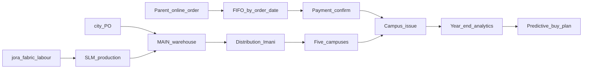
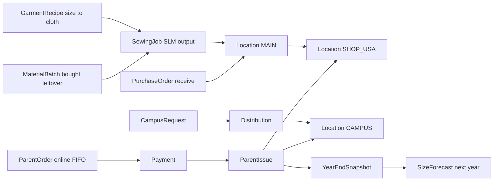
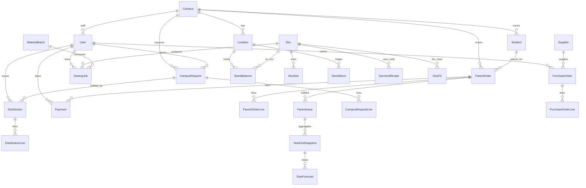

# How we go forward

**Product:** Silverleaf Uniform Tracker  
**Team:** Mourine, Geoffrey, Irene (Nelly on parent/FIFO rules)  
**Decision:** build the **complete** system (inventory, distribution, revenue, costs) — not a thin first slice.  
**Status:** the Next.js app is implemented across all 8 sprints. Excel stays fallback until campuses are trained.

Related docs: [SRS](./SRS.md) · [ARCHITECTURE.md](./ARCHITECTURE.md) (planning report — diagrams + Sprint 1 close-out) · [SPRINTS](./SPRINTS.md) · [backlog.json](./backlog.json) · system map in [source/](./source/)

---

## 1. What we are replacing

Excel / Google Sheets today:

- **Master sheet** — catalogue, parent order form, 7-step process, suppliers, school order, distribution, inventory
- **2026 analysis** — campus demand, coupons vs distribution, sewing tracker, buy/sell/profit

Live process from the 26 Aug meeting + system map:

```
Tailoring (Loveness) → Central inventory (Imani & Loveness) → Distribution (Imani) → 5 campuses
```

| Piece | Who | Notes |
|-------|-----|--------|
| Tailoring | Loveness | Usa River; sewn goods into central |
| Main warehouse | Imani & Loveness | **All city purchases land here first** (e.g. tracksuits) |
| Usa River shop | Loveness | Second warehouse — school shop |
| Distribution | Imani only | Feeds all five campuses |
| Requests | Admins | Usa River + Arusha Town (AM) |
| Requests | Head teachers | Kijenge, Boma, Ilboru |
| Finance view | Finance | Costs, budgets, payments |
| Campus view | HT / admin / principal | Their campus only |
| Parent | Guardian | **Order first**, then confirm payment; FIFO by order date |

Campuses (five): **Usa River, Arusha Town (AM), Kijenge, Ilboru, Boma**.  
Kilizona is on an older sheet — **not** in this map.

Parents and managers also need: student **registration number** (class/gender come with it), and **size velocity** so next year’s buy is data, not a guess.

---

## 1b. Product pillars (what the system does)

Six connected loops — not separate tools:

| # | Pillar | What it means |
|---|--------|----------------|
| 1 | **SLM — production** | **Silverleaf manufacturing:** materials in (jora, fabric, labour) → uniform pieces out. Loveness logs daily jobs; output lands in **MAIN**. |
| 2 | **Parent online order** | Parent portal: pick catalogue + sizes, submit order **online** (no walk-in sheet). Linked to student registration number. |
| 3 | **FIFO queue** | **First come, first served** by **order date**, not payment date. Reduces “who got served first” complaints. |
| 4 | **Distribution** | Imani moves stock MAIN/shop → campuses; campus staff issue to students when paid order reaches front of queue. |
| 5 | **Year-end analytics** | At end of academic year: issued qty by SKU+size, campus, class, gender; stock left; cost vs revenue; sewing vs bought. |
| 6 | **Predictive model** | Use that year’s data to **forecast next year’s buy** — which sizes to order in bulk, per campus. Starts simple (moving averages + class intake); can grow later. |



**SKU reminder:** one catalogue item (e.g. polo `PT1`). Stock is tracked as **SKU + size + location** — not one SKU per physical shirt.

---

## 2. How we will work

1. **Agree this document** (stack, ERD, 8-week timeline, three-person split).
2. **Keep Excel live** until a campus is trained on the app. The workbooks in `docs/source/` are the import snapshot, not the long-term source of truth.
3. **One schema owner.** Mourine (platform) owns Prisma. Geoffrey and Irene consume it — no forked models.
4. **Shule One delivery rhythm.** One-week sprints, day-sized tasks in `backlog.json`. Say “run workbot” only after coding starts.
5. **Build the whole product in 8 weeks**, not “inventory now, finance maybe later.” Screens can land week by week; the data model is complete from week 1.
6. **Demo every Friday** on the five desks: Imani, Loveness, finance, one admin, one head teacher, one parent.

### Three people

| Person | Stream | Owns |
|--------|--------|------|
| **A — Platform** (Mourine) | Schema, auth, campuses, warehouses, seed/import | Data model |
| **B — Desks** (Geoffrey) | Staff screens + parent portal | UI |
| **C — Money** (Irene) | Payments, POs, budget, size demand, sewing P&L | Finance + supply |

---

## 3. Stack

| Layer | Choice | Why |
|-------|--------|-----|
| App | **Next.js** (App Router) + TypeScript | Same family as Shule One; role desks + parent portal |
| UI | React + Tailwind | Fast staff tables; no extra design system |
| Data | **Prisma** + **SQLite** in build/demo | Simple local setup; swap to **PostgreSQL** before several campuses go live together |
| Auth | Cookie session + roles | Imani / Loveness / finance / admin / HT / parent |
| Money | Integer **TZS** (no floats) | Matches the sheets |
| Print | Dedicated print routes | Coupon + delivery note |
| Hosting (later) | One internal URL | Office laptops in the browser |

Not in v1: live Lipa API (record channel + ref only), barcodes, merge into Shule One.

---

## 4. ERD (planned)

Full planning report (roles, ERDs, workflows, Sprint 1 next steps): [ARCHITECTURE.md](./ARCHITECTURE.md). Compact ERD below.

Physical flow vs tables:



Entity relationship (core):



### Tables (what each is for)

| Entity | Purpose |
|--------|---------|
| **Campus** | Five sites; `requestBy` = ADMIN vs HEAD_TEACHER |
| **Location** | `MAIN`, `SHOP_USA`, or `CAMPUS_*` store |
| **User** | Desk login + role + optional campus |
| **Sku / SkuSize** | Catalogue (polo, sweater, …) and allowed sizes |
| **StockBalance** | Qty on hand: location + SKU + size |
| **StockMove** | Ledger (receive, sew-in, transfer, distribute, parent issue) |
| **Student** | Registration number, class, gender, campus |
| **ParentOrder + lines** | Coupon; `orderedAt` drives **FIFO** |
| **Payment** | Second step after order; cash / Lipa / uniform account |
| **ParentIssue** | Hand-over; supports Received all / Received few |
| **CampusRequest + lines** | Admin/HT ask Imani for stock |
| **Distribution + lines** | Delivery note; MAIN/shop → campus |
| **Supplier / PurchaseOrder** | City buy; **receive into MAIN only** |
| **MaterialBatch** | Cloth bought (actual qty + leftover after a job consumes it) |
| **GarmentRecipe** | Metres/cm of jora or fabric each SKU+size needs |
| **SizeFit** | Which size fits which class and gender, per garment |
| **SewingJob** | SLM output: Loveness daily expected vs actual → stock into MAIN |
| **Expense / Budget** | Costs vs allocation; profit = sell − buy − sewing |
| **YearEndSnapshot** | Frozen totals per year: issued, stock, revenue, cost, by SKU+size+campus |
| **SizeForecast** | Predictive buy plan for next year (from snapshot + expected enrolment) |

Full Prisma: [`prisma/schema.prisma`](../prisma/schema.prisma). Parent installable app: `/parent` (works offline). Cloth planner: `/slm`.

---

## 5. Timeline (8 weeks, 3 people)

Complete system by week 8. Excel remains fallback until then.

| Week | Theme | A Platform | B Desks | C Money |
|------|-------|------------|---------|---------|
| **1** | Foundation | Auth, 5 campuses, 2 warehouses | Login + system-map home | Demo users, TZS helpers |
| **2** | Catalogue & stock | SKU+size ledger | Stock table (main / shop / campus) | Opening balances from 2026 sheet |
| **3** | Parent order + FIFO | Student reg. no. | Parent portal: catalogue + order | Payment confirm (order **before** pay) |
| **4** | Distribution | Request → DN rules | Campus request + Imani issue | Partial issue (all / few) |
| **5** | Buying | Supplier + PO | Receive UI; transfer to shop | Cost on receive |
| **6** | SLM production | MaterialBatch → SewingJob | SLM desk (materials in / output) | Material cost vs output |
| **7** | Year analytics | YearEndSnapshot job | Analytics dashboard | Buy vs sell vs margin report |
| **8** | Predict + handoff | SizeForecast (simple model) | Parent portal polish + printables | Predictive buy plan export; walkthrough with Imani & Loveness |

**Done when:** Loveness logs SLM (materials → output), a parent **orders online** and pays, FIFO queue is visible, Imani distributes to campuses, year-end analytics run, and finance gets a **predictive buy plan** for next year — not a guess from a spreadsheet.

Sprint-level tasks: [SPRINTS.md](./SPRINTS.md) and [backlog.json](./backlog.json) (48 tasks, ~1 day each).

---

## 6. Folder structure

Implemented under `src/` (staff desks, parent portal, print routes, server actions).

```
silverleaf-uniforms/
  docs/
    GOING-FORWARD.md    ← this file
    SRS.md
    ROADMAP.md
    SPRINTS.md
    CURRENT.md
    backlog.json
    source/             ← both Excel files + system map PNG
  prisma/
    schema.prisma       ← live ERD (wired through the app)
  src/
    app/
      login/
      (app)/            staff console
        desk/           system map
        stock/
        slm/              production: materials in → output
        sewing/
        requests/
        distribution/
        orders/         coupons + FIFO
        purchase-orders/
        finance/
        sizes/            year-end + predictive buy plan
        analytics/
      (parent)/parent/  parent portal (online order + FIFO position)
      (print)/coupon/
      (print)/delivery-note/
    components/
    lib/
  scripts/              workbot later
```

---

## 7. Next step

Run `npm install && npm run db:setup && npm run dev`. Walk Imani and Loveness through the README demo. Keep Excel as fallback until a campus is trained.
