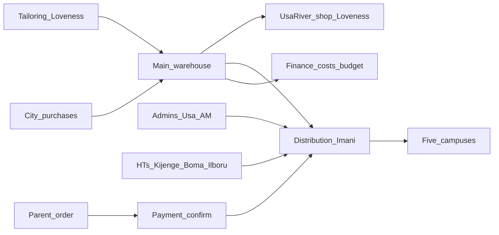

# Roadmap — Silverleaf Uniform Tracker

**Product:** Complete uniform operations across five campuses (not a thin inventory slice).  
**Team:** 3 people — Mourine, Geoffrey, Irene. Nelly joins timing / method discussions.  
**Horizon:** 8 one-week sprints (~8 weeks).  
**Decision (meeting 26 Aug 2026):** build distribution, inventory, revenue, and costs together — do not ship a “small then maybe later” product.

This is the short routing doc. Full requirements: [SRS.md](./SRS.md). Calendar: [SPRINTS.md](./SPRINTS.md).

---

## Stack

| Layer | Choice |
|-------|--------|
| App | Next.js App Router + TypeScript |
| Data | Prisma + SQLite (dev); Postgres before multi-campus production load |

### Backup / Postgres (production)

- **Dev / single-office demo:** SQLite file at `prisma/dev.db`. Copy that file for a backup; `npm run db:setup` rebuilds it from seed.
- **Several campuses live together:** switch `datasource` in `prisma/schema.prisma` to `postgresql`, set `DATABASE_URL` to the server, then `npx prisma migrate diff --from-empty --to-schema-datamodel prisma/schema.prisma --script` (or `prisma db push` once) to create the first migration. Session cookie (`AUTH_SECRET`) must be a long random value. Nightly: `pg_dump` the database plus a CSV export of size velocity (`/api/sizes/export`). There is no `prisma/migrations/` folder yet — demo uses SQLite + `db push`.
- Keep Excel in `docs/source/` as the historical snapshot only.
| Auth | Role desks (cookie session) |
| Money | TZS integer amounts (no floats) |
| Source files | `docs/source/*.xlsx` + system map PNG |

Same family as Shule One. **Separate repo** — Silverleaf needs campus stock, two warehouses, coupons vs distribution, POs, sewing, and a parent portal that Shule One’s single-school shop does not cover.

---

## What is needed (non-code)

- Both Excel masters in `docs/source/` (already copied)
- Confirmed campus list of **five**: Usa River, Arusha Town (AM), Kijenge, Ilboru, Boma
- Named operators: **Imani** (central inventory + all distribution), **Loveness** (tailoring + Usa River shop)
- Who may request stock: **admins** (Usa River, AM) vs **head teachers** (Kijenge, Boma, Ilboru)
- Payment channels in use: uniform account, Lipa, cash, mixed
- Student **registration numbers** so grade/gender come with the child
- One shared demo password and Node 20+

---

## How the system is done

Physical flow (from the tracker map):

```
Tailoring (Loveness) → Central inventory (Imani & Loveness) → Distribution (Imani) → 5 campuses
```

Two warehouses:

1. **Main warehouse** — city purchases (tracksuits and the rest) land here first, under Imani and Loveness
2. **Usa River shop** — school shop managed by Loveness

Parent loop (Nelly): **order first** (FIFO by order date) → **confirm payment** → then issue. Link orders to student registration number. Track which sizes move so next year’s buy is data, not a guess.

Finance sees costs, budgets, and payments on central inventory. Campus staff see only their campus.



---

## Team of three

| Person | Stream | Owns |
|--------|--------|------|
| **A — Platform** (Mourine) | Schema, auth, campuses, warehouses, Excel import, seed | Data model is not forked |
| **B — Desks** (Geoffrey) | Catalogue, stock, campus requests, distribution, parent order UI | Staff + parent screens |
| **C — Money** (Irene) | Payments, POs, delivery notes, budget vs actual, size demand, sewing P&L | Finance + supply |

Nelly reviews FIFO / parent order rules in sprint 3.

---

## Timeline (8 weeks)

| Week | Theme | A | B | C |
|------|-------|---|---|---|
| **1** | Foundation | Auth, roles, five campuses, two warehouses | Desk shell + login | TZS helpers, demo users |
| **2** | Catalogue & stock | SKU+size ledger, stock balances | Stock table (main / shop / campus) | Opening balances from 2026 sheet |
| **3** | Parent order + pay | Student register no. | Parent portal: catalogue, order, FIFO queue | Payment confirm (order before pay) |
| **4** | Distribution | Request → DN model | Campus request + Imani issue desk | Partial issue (Received all / few) |
| **5** | Buying | Supplier + PO receive into **main** first | Receive UI + transfer to shop | Cost on receive; budget lines |
| **6** | Demand & profit | Size-velocity queries | Manager size dashboard | Buy vs sell vs margin (network + campus) |
| **7** | Sewing | Sewing jobs → stock in | Daily tailor tracker | Materials (jora) + labour vs budget |
| **8** | Harden | Import snapshot, backups note | Print coupon + delivery note | Smoke all roles; CURRENT.md complete |

**Definition of done for the 8 weeks:** Imani can receive city stock into main, Loveness can log sewn pieces, a parent can order then pay, Imani can distribute to a campus on a head-teacher request, finance can see cost vs revenue. Excel is fallback only.

---

## Out of scope until after week 8

- Live Lipa / mobile-money API (record channel + ref in v1)
- Barcodes / scanners
- Merging this app into Shule One
- Kilizona as a sixth campus (present on an older sheet; **not** on the five-campus map)

---

## Risks

| Risk | Mitigation |
|------|------------|
| Spreadsheets disagree | App is source of truth after go-live; Excel is import snapshot |
| Scope creep back to “inventory only” | Meeting decision stands — complete system; extra ideas go to a later note, not W1–W8 |
| Three people forking schema | A owns Prisma; B/C consume it |
| FIFO fights at the window | Queue is `orderedAt` ascending; payment does not jump the line |
| No student ID on a coupon | Allow name + class + campus; registration number optional then backfilled |
